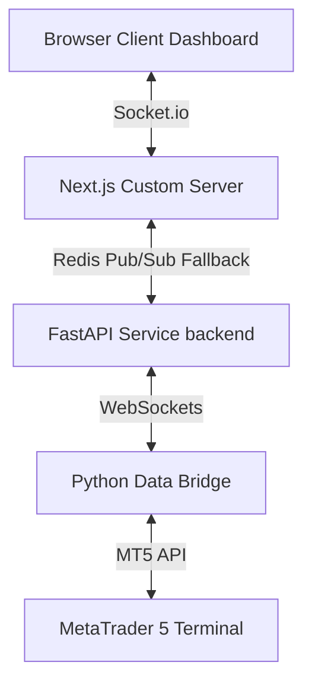

# AURIC PRO V2.0 — High-Frequency Algo-Trading SaaS

AURIC PRO is a professional, high-performance web dashboard and algorithmic automated broker connection pipeline. It links MetaTrader 5 (MT5) with a modern React/Next.js dashboard to provide real-time pricing streams, AI analytics commentary, backtesting execution, and auto-executed order commands.

---

## Architecture Overview



AURIC PRO features a hybrid multi-service architecture:
1. **Next.js Frontend (Port 3000)**: Houses the interactive order flow dashboard, charts, risk panels, strategies configurator, and billing settings.
2. **FastAPI Backend (Port 8000)**: Serves as a low-latency price, position, and command websocket relay. Integrates directly with Supabase DB and runs system tasks.
3. **Python Data Bridge (`bridge.py`)**: Runs alongside MT5 (via official python API wrapper) to stream tick data and execute instant transactions.

---

## Deployment Modes for MT5 Bridge

### 1. Cloud Mode (Default for normal users)
- Running on a Windows EC2 instance, the FastAPI backend hosts, decrypts, and runs `bridge.py` subprocesses automatically for active users.
- Users only need to input their broker credentials in the browser settings; no downloads or local setups are required.

### 2. Local Mode (Admin-only option)
- Admin can toggle Cloud Mode off in Settings to run the bridge locally on their Windows PC.
- Download the script via `public/bridge/bridge.py` and run it locally to sync with your MT5 desktop application.

---

## Installation & Setup

### Prerequisites
- **Node.js**: v20+
- **Python**: v3.10+ (specifically on Windows for MT5 support)
- **Redis**: Running local server or remote instance (for state caching & pub/sub sync)
- **Supabase**: Active Postgres database & Auth API keys
- **MetaTrader 5**: Windows client installed and logged into a demo/live account

---

## Configuration (`.env.local`)

Create a `.env.local` file in the root directory:

```env
# Supabase Configuration
NEXT_PUBLIC_SUPABASE_URL=https://<your-ref>.supabase.co
NEXT_PUBLIC_SUPABASE_ANON_KEY=<anon-public-key>
SUPABASE_SERVICE_ROLE_KEY=<service-role-key>

# Python API Relay URL
PYTHON_API_URL=http://localhost:8000

# Redis Cache URI
REDIS_URL=redis://localhost:6379

# Razorpay Subscription Billing
RAZORPAY_KEY_ID=rzp_test_<your-key-id>
RAZORPAY_KEY_SECRET=<your-key-secret>
RAZORPAY_WEBHOOK_SECRET=<your-webhook-signing-secret>

# Razorpay Plan IDs
RAZORPAY_PLAN_PRO_ID=plan_P1234567890
RAZORPAY_PLAN_ELITE_ID=plan_E1234567890

# Admin Role Configuration
NEXT_PUBLIC_ADMIN_EMAIL=admin@auricpro.com
SYSTEM_SECRET=auric_secret_system_token_2026

# AI Advisor
GEMINI_API_KEY=<your-google-gemini-key>

# App Config
PORT=3000
NODE_ENV=development
```

---

## Starting the Application

### 1. Install Dependencies
```bash
npm install
pip install websockets MetaTrader5 cryptography httpx
```

### 2. Start FastAPI Backend (Port 8000)
```bash
python backend/main.py
```

### 3. Start Next.js Development Server (Port 3000)
```bash
npm run dev
```

---

## EC2 Windows Server Deployment Guide

To deploy the entire stack to a Windows EC2 Server so that normal users can connect automatically:

### 1. Install MetaTrader 5 on the Server
- Download and install MetaTrader 5 on the Windows Server.
- Open MT5 and log in to a broker account (to initialize settings and terminal paths).
- Ensure "Allow WebRequest" is enabled in MT5 Options.

### 2. Setup Node.js, Python, and Git
- Install Git, Node.js, and Python 3.10+ on the EC2 instance.
- Clone the repository to the EC2 server:
  ```bash
  git clone <repository-url>
  ```

### 3. Install PM2 (Process Manager)
```bash
npm install -g pm2
pm2-windows-startup install
```

### 4. Create PM2 Startup Configuration (`ecosystem.config.js`)
Create an `ecosystem.config.js` file in the root directory:
```javascript
module.exports = {
  apps: [
    {
      name: "auric-next",
      script: "npm",
      args: "run start",
      env: {
        NODE_ENV: "production"
      }
    },
    {
      name: "auric-fastapi",
      script: "python",
      args: "backend/main.py",
      autorestart: true
    }
  ]
};
```
Start both services via PM2:
```bash
pm2 start ecosystem.config.js
pm2 save
```

---

## Razorpay Gateway Integration Setup

1. **Dashboard Setup**:
   - Go to Razorpay Dashboard -> Subscriptions -> Plans.
   - Create two plans: Pro ($49/mo) and Elite ($149/mo).
   - Copy the Plan IDs and configure them in `.env.local`.

2. **Webhook Setup**:
   - Go to Settings -> Webhooks.
   - Add a Webhook URL pointing to `https://yourdomain.com/api/webhooks/razorpay`.
   - Select the following events:
     - `subscription.charged`
     - `subscription.cancelled`
     - `subscription.halted`
   - Set a webhook secret and configure it as `RAZORPAY_WEBHOOK_SECRET` in `.env.local`.
